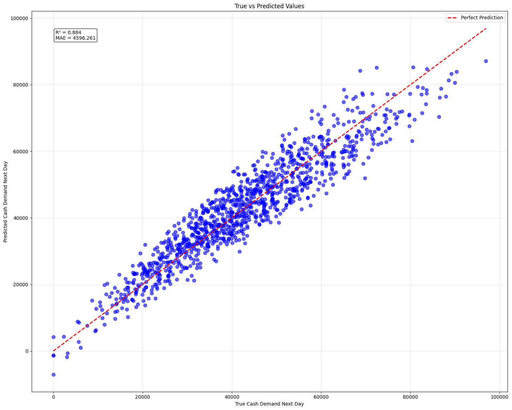

# ATM Cash Demand Forecasting

This project predicts the next day's cash demand for ATMs using machine learning models. It helps optimize ATM cash refills, reduce operational costs, and prevent cash-outs.

## Features
- **Data Preprocessing:**
  - Handles missing values, encodes categorical variables, and scales numeric features.
- **Feature Engineering:**
  - Uses historical cash levels, withdrawals and deposits to calculate moving averages, cash utilization rates, and more
- **Model Training:**
  - Trains and compares Random Forest, XGBoost, and Linear Regression models.
- **Model Evaluation:**
  - Evaluates models using MAE and R² metrics.
- **Model Saving:**
  - Saves trained models for future predictions.


## Example Results
```
Training RandomForest...
RandomForest - MAE: 4853.136, R^2: 0.866
Training XGBoost...
XGBoost - MAE: 4899.299, R^2: 0.861
Training LinearRegression...
LinearRegression - MAE: 4596.261, R^2: 0.884

Best model: LinearRegression (R² = 0.884)
```
## Linear Regression Results

